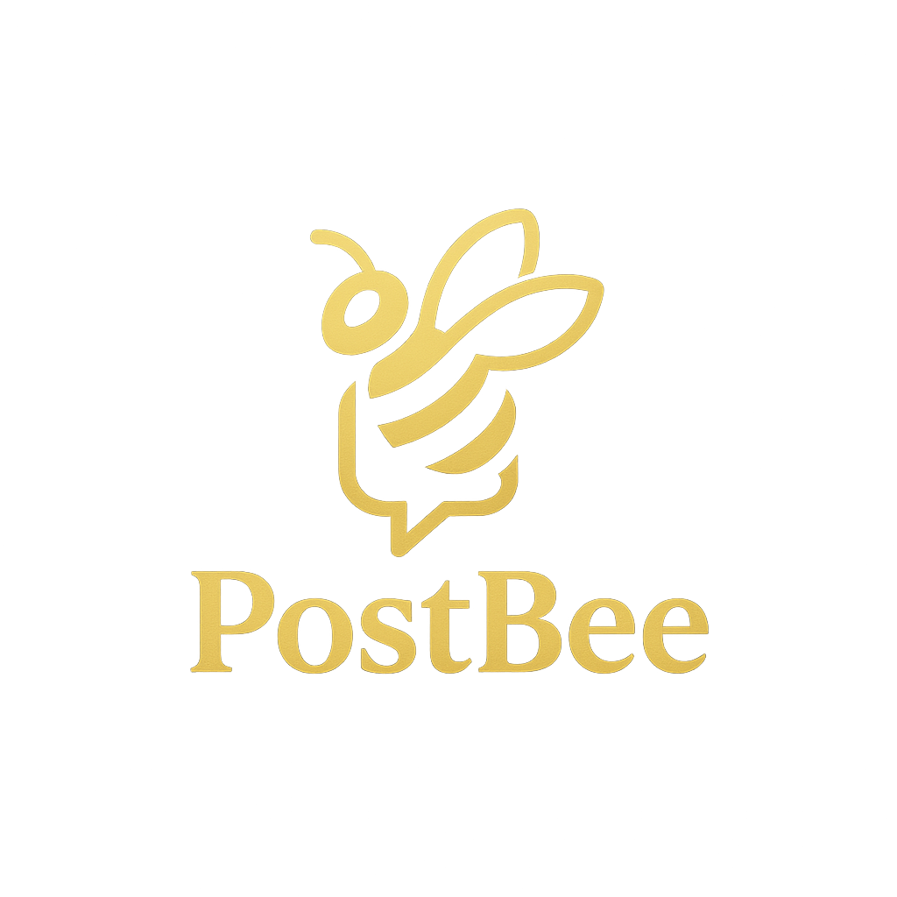

<div align="center">
  
  <h1>PostBee Web App 🐼</h1>
  <p>
    
    
    
    
    
    <!--  -->
    <!--  -->
    
    
    
    
    
    
    
    
    
  </p>
  <p><b>The social platform for sharing, connecting, and buzzing with your community!</b></p>
</div>

---

## ✨ Overview

PostBee is a modern, full-featured social web app built with Next.js, TypeScript, and a beautiful UI. Share posts, comment, like, follow users, and manage your profile in a seamless, real-time experience. Powered by a robust API and designed for extensibility.

---

## 🚀 Features

- 📝 **Create, edit, and delete posts** (with media support)
- 💬 **Comment** on posts and join the conversation
- 👍 **Like** and engage with content
- 🧑‍🤝‍🧑 **Follow** and connect with other users
- 👤 **Profile management** with avatar upload
- 🔒 **Authentication** (login/logout)
- 🌙 **Modern UI** with skeleton loaders and responsive design
- ⚡ **Real-time updates** and smooth navigation
- 🧪 **End-to-end tested** with Playwright

---

## 🛠️ Tech Stack

- ⚡️ [Next.js 13+](https://nextjs.org/) (App Router)
- 🟦 [TypeScript](https://www.typescriptlang.org/)
- 🎨 [Tailwind CSS](https://tailwindcss.com/)
- 🧪 [Playwright](https://playwright.dev/) for testing
- 🔗 [OpenAPI](https://swagger.io/specification/) client generation
- 🧩 Custom UI components & hooks

---

## ⚡ Quick Start

Clone the repo and install dependencies:

```bash
git clone https://github.com/ost-cas-fea-25-26/postbee-ui-lib
cd postbee-app
npm install
```

Start the development server:

```bash
npm run dev
```

Visit [http://localhost:3000](http://localhost:3000) to see PostBee in action!

---

## 🔑 Authentication Setup

To enable authentication, generate a secret and add it to your `.env`:

```bash
npx @better-auth/cli@latest secret
```

Add the generated `AUTH_SECRET` to your `.env` file.

---

## 📁 Project Structure

```
src/
  actions/         # Server actions (posts, comments, followers, etc)
  app/             # Next.js app directory (routing, pages, layouts)
  components/      # UI components (posts, comments, profile, core, etc)
  lib/             # API clients, types, utilities
  public/          # Static assets (logo, images)
  tests/           # Playwright tests
```

---

## 🧩 Main Components

- **Posts**: Create, list, like, and manage posts
- **Comments**: Add and view comments on posts
- **Followers**: Follow/unfollow users
- **Profile**: User info, avatar, settings, tabs
- **Core UI**: Card, Dropdown, Form, Skeleton, Header, etc.

---

## 🧪 End-to-End Testing

PostBee uses [Playwright](https://playwright.dev/) for robust end-to-end (E2E) testing. All critical user flows are covered to ensure reliability and a great user experience.

- All E2E tests are located in the `tests/` directory.
- Run all E2E tests:

```bash
npm run test:e2e
```

- Playwright provides cross-browser testing, screenshots, and detailed reports.
- To view the latest test report, open `playwright-report/index.html` after running tests.

Learn more about Playwright in the [official docs](https://playwright.dev/).

---

## 📦 API & OpenAPI

PostBee uses an auto-generated API client from an OpenAPI spec. Update the client with:

```bash
npx openapi-ts
```

---

## 🌍 Deployment

Deploy easily on [Vercel](https://vercel.com/) or your favorite platform.

---

## 🤝 Contributing

1. 🌿 Create a feature branch
2. 🔨 Build and test locally
3. ✨ Add stories and tests for new components
4. 📤 Submit a PR

---

## 📚 References

- ⚛️ **React**: https://react.dev
- 🎨 **Tailwind CSS**: https://tailwindcss.com
- ♿ **Radix UI**: https://www.radix-ui.com/primitives
- 📖 **Storybook**: https://storybook.js.org
- 🧪 **Testing Library**: https://testing-library.com/docs/react-testing-library/intro
- 🚀 **Playwright**: https://playwright.dev
- 🔗 **OpenAPI**: https://swagger.io/specification/

---

## 👥 Contributors

Made with ❤️ by the PostBee Team. All trademarks are property of their respective owners.

- 👨‍💻 [@ricardo17coelho](https://github.com/ricardo17coelho)
- 👨‍💻 [@vco-80](https://github.com/vco-80)